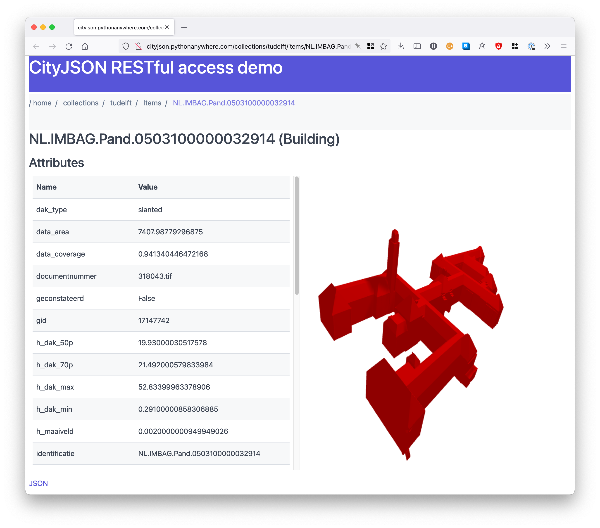

<h1>{{ page.title }} beta</h1>

## RESTful access

We envision CityJSON being used, exchanged, manipulated, and viewed __on the web__.

We have built a super simple [RESTful access](https://en.wikipedia.org/wiki/Representational_state_transfer) to CityJSON datasets, it uses [Flask](https://palletsprojects.com/p/flask/) as a server, and the datasets are simply hosted on the server and [cjio](https://github.com/cityjson/cjio) is used obtain subsets of the datasets.

The demo is inspired from the [OGC API -- Features](https://github.com/opengeospatial/ogcapi-features) and especially the [pygeoapi demo](https://demo.pygeoapi.io/stable), but it is not OGC-compliant (yet).

<i class="fab fa-github"></i> <a href="https://github.com/cityjson/restful_demo">code of the demo</a>

## Streaming 

The demo contains the code to *stream* the datasets, by using [`CityJSONFeature`](https://www.cityjson.org/specs/1.1.0/#text-sequences-and-streaming-with-cityjsonfeature).

If `/stream/` is added to the URL of any collections in the demo, then a [JSON Lines](https://jsonlines.org/) is returned. 
This is realised with `cjio myfile.city.json export --format jsonl`.

<i class="fas fa-external-link-alt"></i> <a href="http://cityjson.pythonanywhere.com/collections/tudelft/stream/">http://cityjson.pythonanywhere.com/collections/tudelft/stream/</a>